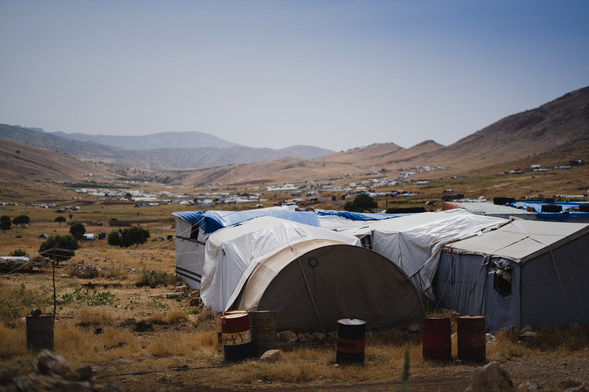
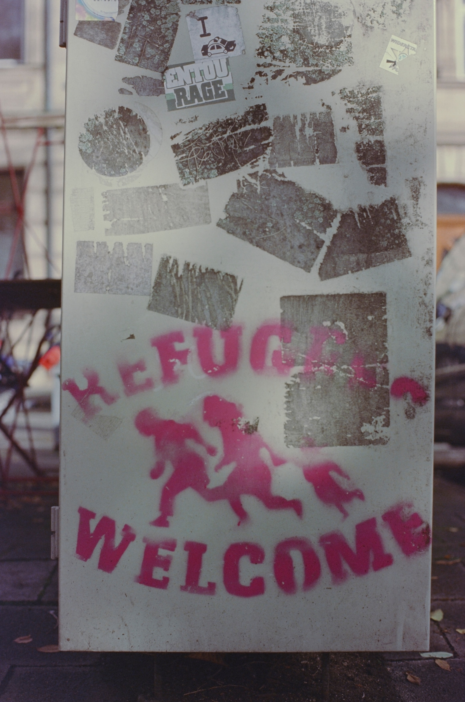

# Overview

This project is for fun. Any materials used are properties of their rightful owners :innocent:

## Run the project

The project can be run in any modern browser.
First fork the website to your own account(If you have one)
Then clone the repository to your local machine

For https  

```bash
git clone https://github.com/username/repositoryName.git
```

For SSH

```bash
git clone git@github.com:username/repositoryName.git
```  

Then open the `index.html` using your favourite browser.  

Voila! You are done.

## Attributes

[Levi Meir Clancy](https://unsplash.com/@levimeirclancy?utm_source=unsplash&utm_medium=referral&utm_content=creditCopyText) on [Unsplash](https://unsplash.com/s/photos/refugee-camp?utm_source=unsplash&utm_medium=referral&utm_content=creditCopyText)

[Larm Rmah](https://unsplash.com/@larm?utm_source=unsplash&utm_medium=referral&utm_content=creditCopyText) on [Unsplash](https://unsplash.com/s/photos/helping-people?utm_source=unsplash&utm_medium=referral&utm_content=creditCopyText)

[Markus Spiske](https://unsplash.com/@markusspiske?utm_source=unsplash&utm_medium=referral&utm_content=creditCopyText) on [Unsplash](https://unsplash.com/s/photos/refugee?utm_source=unsplash&utm_medium=referral&utm_content=creditCopyText)
